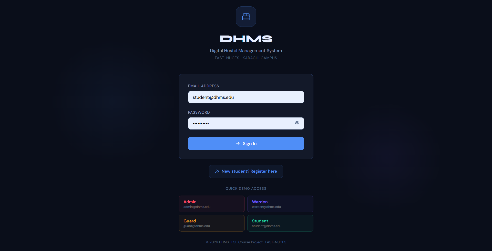
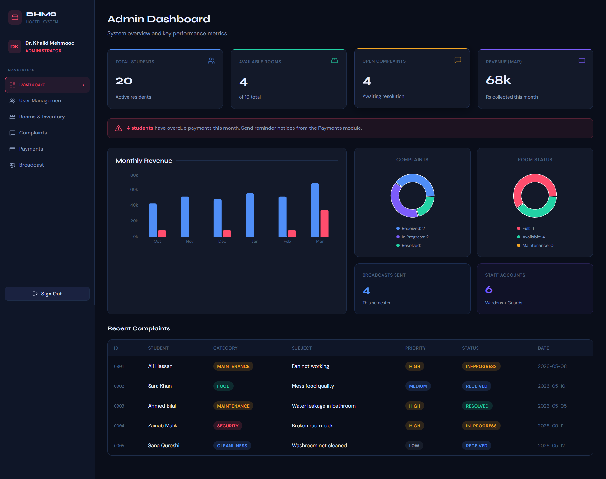
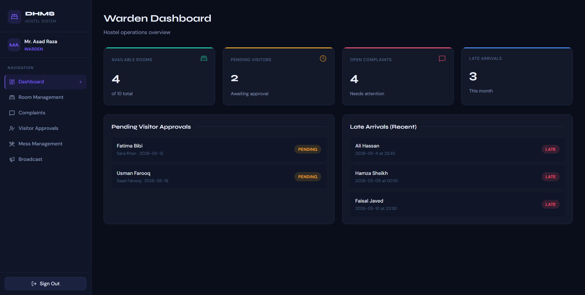
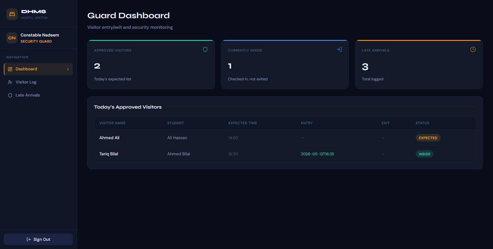
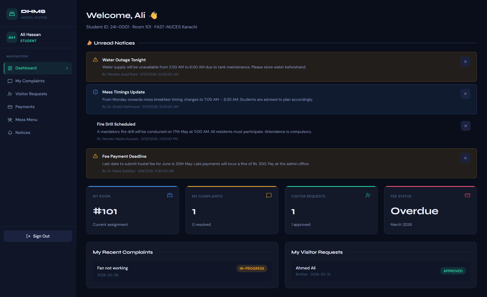

# 🏠 DHMS — Digital Hostel Management System

> A role-based web application that fully digitizes university hostel administration — from visitor logging and complaint tracking to payment management and emergency broadcasts.

Developed as a semester project for **Fundamentals of Software Engineering** at **FAST NUCES Karachi** (Spring 2026).

---

## 📋 Table of Contents

- [Overview](#overview)
- [Features](#features)
- [Tech Stack](#tech-stack)
- [System Architecture](#system-architecture)
- [Modules](#modules)
- [Getting Started](#getting-started)
- [API Reference](#api-reference)
- [Role-Based Access](#role-based-access)
- [Testing](#testing)
- [Future Work](#future-work)
- [Team](#team)

---

## Screenshots







---

## Overview

University hostels running on paper registers, WhatsApp messages, and spreadsheets face a recurring set of problems: visitor logs get lost, room assignments cause disputes, complaints go unresolved, and emergency notices reach students too late.

DHMS replaces all of that with a single, unified web platform serving four user roles — **Admin**, **Warden**, **Security Guard**, and **Student** — each operating within strictly enforced permission boundaries.

---

## Features

- 🔐 **Role-Based Access Control (RBAC)** — four distinct roles with enforced permission boundaries at both the UI and API levels
- 🏘️ **Room & Asset Inventory** — per-room asset registers verified at check-in/check-out to enforce accountability
- 📢 **Emergency Broadcast Module** — real-time notices pushed to all student dashboards with read-receipt tracking
- 📋 **Complaint Pipeline** — categorized complaint submission, priority assignment, and status tracking
- 👤 **Visitor Management** — student requests → warden approval → guard entry/exit logging
- 💳 **Digital Payments** — fee submission with auto-generated receipt IDs and admin financial dashboard
- 🍽️ **Mess Management** — weekly meal menu with breakfast, lunch, and dinner
- 🚨 **Late Arrival Logging** — guards log student late arrivals with room, time, and reason

---

## Tech Stack

| Layer | Technology |
|---|---|
| Backend | Python 3.x, Flask 2.x |
| Database | SQLite 3 (`hostel.db`) |
| Frontend | HTML5, CSS3, JavaScript (ES6+) |
| UI Framework | Bootstrap 5 (CDN) |
| API Style | RESTful JSON |
| CORS | Flask-CORS |
| Version Control | GitHub |
| API Testing | Postman |
| Deployment | PythonAnywhere |

---

## System Architecture

DHMS follows a classic **three-tier architecture**:

```
[ Browser — HTML/CSS/JS/Bootstrap ]
            │  fetch() JSON
[ Flask REST API — app.py ]
            │  sqlite3
[ SQLite Database — hostel.db ]
```

The frontend is fully client-side — no server-side rendering. All data is fetched from the backend via a single `GET /api/all-data` sync call on login, with targeted re-fetches after mutations.

---

## Modules

### 1. User Management
Admin creates Warden and Guard accounts. Students self-register with validation on CNIC format, student ID, and email uniqueness. Unified login returns a role object used by the frontend for RBAC rendering.

### 2. Room & Inventory Management
Wardens create and manage room records (single/double/triple). Each room carries a JSON asset inventory (beds, fans, desks, ACs). Occupancy status auto-updates against capacity.

### 3. Complaint Management
Students submit categorized complaints (maintenance, food, security, administrative). Wardens assign priority (high/medium/low) and move tickets through `received → in-progress → resolved`.

### 4. Visitor Management
Students submit visitor requests with CNIC and expected time. Wardens approve or reject. Guards log actual entry/exit timestamps and separately record late student arrivals.

### 5. Payment Management
Students submit their monthly fee (Rs. 8,500 for MVP). A digital receipt ID is auto-generated on confirmation. Admins view all payment statuses and financial summaries. Guards have zero access to this module.

### 6. Mess Management
Wardens publish a weekly meal menu covering all 7 days across breakfast, lunch, and dinner. Students view the menu in read-only mode from their dashboard.

### 7. Emergency Broadcast Module *(Innovation Feature)*
Admins and Wardens publish notices with urgency levels (`info` / `warning` / `urgent`). Notices appear instantly on all student dashboards. Students dismiss broadcasts after reading, appending their ID to the `readers[]` array for admin visibility.

---

## Getting Started

### Prerequisites

- Python 3.8+
- pip

### Installation

```bash
# Clone the repo
git clone https://github.com/<your-username>/dhms.git
cd dhms

# Install dependencies
pip install flask flask-cors

# Initialize the database
python __init__db.py

# Run the backend
python app.py
```

The Flask server starts on `http://localhost:5000`.

Open `index.html` (or use VS Code Live Server on port 5500) to launch the frontend.

### Default Credentials (Seed Data)

| Role | Email | Password |
|---|---|---|
| Admin | admin@dhms.com | admin123 |
| Warden | warden@dhms.com | warden123 |
| Guard | guard@dhms.com | guard123 |

> ⚠️ Passwords are stored in plaintext for MVP demo purposes. **Do not deploy to production without bcrypt hashing.**

---

## API Reference

All endpoints consume and return JSON. The global sync endpoint returns all system data in a single call.

| Method | Endpoint | Description |
|---|---|---|
| `GET` | `/api/all-data` | Full system state: users, rooms, complaints, payments, visitors, late arrivals, broadcasts, mess menu |
| `POST` | `/api/login` | Authenticate user; returns user object with role |
| `POST` | `/api/register` | Student self-registration |
| `POST` | `/api/users/staff` | Admin-only: create warden or guard account |
| `GET/POST` | `/api/rooms` | List rooms or add a new room |
| `PUT/DELETE` | `/api/rooms/{id}` | Update or delete a room |
| `GET/POST` | `/api/complaints` | List complaints or submit a new one |
| `PUT` | `/api/complaints/{id}` | Warden updates status and priority |
| `GET/POST` | `/api/visitors` | List visitor requests or submit a new one |
| `PATCH` | `/api/visitors/{id}` | Update status, entry time, or exit time |
| `GET/POST` | `/api/late-arrivals` | List or log a late arrival |
| `GET/POST` | `/api/payments` | List payments or submit a fee |
| `PUT` | `/api/payments/{id}` | Admin updates payment status |
| `GET/POST` | `/api/broadcasts` | List broadcasts or publish a new notice |
| `PATCH` | `/api/broadcasts/{id}` | Student marks broadcast as read |

---

## Role-Based Access

| Feature | Admin | Warden | Guard | Student |
|---|---|---|---|---|
| User & staff management | ✅ | ❌ | ❌ | ❌ |
| Room & asset management | View | ✅ | ❌ | ❌ |
| Complaint resolution | Audit | ✅ | ❌ | Submit |
| Visitor approval | View | ✅ | Log entry/exit | Submit |
| Late arrival logging | View | View | ✅ | ❌ |
| Payment management | ✅ | ❌ | ❌ | Submit |
| Emergency broadcasts | ✅ | ✅ | ❌ | View |
| Mess menu | View | Manage | ❌ | View |

---

## Testing

22 test cases were executed using Postman and manual browser testing across all four role dashboards. All 22 passed.

| Category | Cases | Passed |
|---|---|---|
| Authentication | 2 | 2 |
| Registration & User Management | 3 | 3 |
| Room Management | 3 | 3 |
| Complaint Management | 2 | 2 |
| Visitor & Late Arrival | 4 | 4 |
| Payment Management | 2 | 2 |
| Broadcast Module | 2 | 2 |
| Global Sync & Misc | 4 | 4 |
| **Total** | **22** | **22** |

---

## Future Work

- [ ] Password hashing with bcrypt (pre-production requirement)
- [ ] Native mobile app (React Native / Flutter) using the existing REST API
- [ ] Real-time push notifications via Flask-SocketIO
- [ ] Payment gateway integration (JazzCash / EasyPaisa)
- [ ] Dynamic warden-editable mess menu
- [ ] Exportable PDF/Excel reports for financials and complaint analytics
- [ ] Multi-hostel / multi-campus support
- [ ] Biometric/RFID gate integration
- [ ] Automated overdue payment reminders (Celery + Redis)

---

## Team

| Name | Student ID |
|---|---|
| Mahad Munawar | 24I-0065 |
| Dev Kumar | 24K-0028 |

**Supervisor:** Ms. Sania Urooj  
**Institution:** FAST NUCES, Karachi Campus  
**Course:** Fundamentals of Software Engineering  
**Submission:** May 2026

---

## License

This project was developed for academic purposes as part of the FSE semester project at FAST NUCES Karachi. All rights reserved by the authors.
